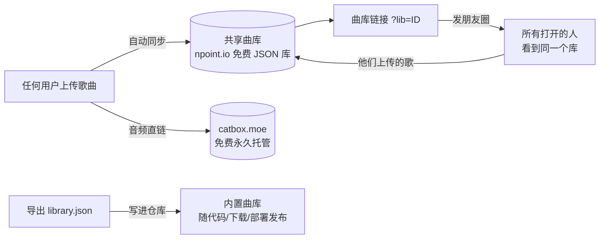

<p align="center">
  
</p>

<h1 align="center">SongLearn · 听歌学外语</h1>

<p align="center">
  上传一首歌 → 自动识曲 → 歌词逐句对齐 → 卡拉OK式跟唱 + 实时翻译 + 音标。<br/>
  <strong>曲库是项目资产</strong>：上传即入库，一条链接共享给所有人，越攒越值钱。
</p>

<p align="center">
  
  
  
  
  
</p>

---

## 为什么做这个

现有「听歌学外语」工具都有一个顽疾：**歌词和歌声永远对不上**——前奏就蹦歌词、高潮对不上高亮、一拖动进度条全乱。

SongLearn 从同步引擎到歌词获取全部重写，并把**歌曲库做成项目的长期资产**：不是某个人的浏览器缓存，而是所有使用者共同积累的财富。

## 核心特性

| 能力 | 实现方式 |
|---|---|
| 🎯 **歌词逐句对齐** | rAF 同步引擎只读媒体时钟（零漂移）+ 人声频带检测 + 乐句点吸附 |
| 🎧 **听声识曲** | audD 音频指纹（与"听歌识曲"同原理，不读文件名），免费 token 即用 |
| 📝 **自动找歌词** | lrclib.net 多通道取词 + 重音不敏感严格匹配，防串歌、防空手而归 |
| 🗣️ **实时翻译** | 唱到哪句译到哪句，译成你选的母语（Google/MyMemory 免费接口） |
| 🔁 **单句精学** | 唱完一句自动暂停，再按播放=重唱这一句，配合 0.75× 慢速 |
| 📚 **三层曲库** | 共享库（人人可见）· 内置库（随仓库发布）· 本地缓存（秒开） |

## 曲库：项目资产，越攒越值钱

这是 SongLearn 与普通工具最大的区别——**曲库不属于某个浏览器，属于整个项目**：



- **共享曲库（免费云，零配置）**：元数据和歌词存 [npoint.io](https://npoint.io)（免注册免密钥的公共 JSON 库），音频匿名传 [catbox.moe](https://catbox.moe) 拿永久直链。在歌曲库里一键「创建共享曲库」，把**曲库链接**发朋友圈，任何人点开都进入同一个库；**他们上传的歌自动进这个库**，还带上传者署名和学唱热度。
- **内置曲库（随项目走）**：歌曲库 → 「导出曲库」下载 `library.json`，覆盖进 `src/data/library.json` 重新部署——曲库就"长"进项目里，下载项目、重新发布都带着全部歌曲。
- **本地缓存（体验层）**：每首歌连同音频存进浏览器 IndexedDB，下次点开秒进学唱页；云端歌曲打开过一次也会自动落一份本地缓存。

三层自动合并去重（本地 > 云端 > 内置），同名歌只留一条。

> **免费额度说明**：npoint 免费档约 100KB（约 100 首歌的元数据+歌词），catbox 单文件上限 200MB（本项目克制在 15MB，超时自动降级为"仅共享歌词"）。小规模共享绰绰有余；想扩容可换成 Cloudflare D1+R2（同样免费档更大）。

## 快速开始

```bash
npm install
npm run dev      # 本地开发
npm run build    # 构建，产物在 dist/
```

### 配置（只有一项，可选）

| 功能 | 需要什么 |
|---|---|
| 听声识曲 | 免费 audD token：[audd.io](https://audd.io) 注册即送，上传页粘贴保存 |
| 共享曲库 | **什么都不需要**，歌曲库里点「创建共享曲库」即可 |
| 找歌词 / 翻译 | 无需配置，直连免费接口 |

## 部署（曲库跟着走）

静态站点，三个平台任选：

- **Vercel**：导入仓库即部署（`vercel.json` 已配好）
- **Netlify**：拖 `dist/` 到 [Netlify Drop](https://app.netlify.com/drop) 或导入仓库（`netlify.toml` 已配好）
- **GitHub Pages**：推 `main` 分支自动部署（`.github/workflows/gh-pages.yml` 已配好）

部署后创建共享曲库，把 `你的域名/?lib=库ID` 发出去即可。

## 技术栈与目录

```
src/
├── App.tsx              # 总编排：四步流水线 + 三层曲库
├── hooks/useSyncEngine.ts  # rAF 同步引擎（不漂移的心脏）
├── lib/
│   ├── align.ts         # 对齐：FFT 乐句检测 + 人声频带 + 锚点吸附
│   ├── lrc.ts           # LRC 解析 + 纯文本切句
│   ├── lyrics.ts        # lrclib 多通道取词 + 防串歌匹配 + 语言检测
│   ├── recognize.ts     # audD 听声识曲
│   ├── globalLib.ts     # 共享曲库：npoint 读写 + catbox 音频托管
│   ├── library.ts       # 三层合并 / 导出导入 / 内置库
│   ├── songdb.ts        # 本地 IndexedDB 存档
│   ├── translate.ts     # 逐句翻译（Google gtx + MyMemory 备源）
│   └── clock.ts         # 统一时间源抽象
└── data/library.json    # 内置曲库种子（导出后覆盖这里）
```

## 路线图

- [ ] 跟唱打分（音高比对）
- [ ] 生词本导出 Anki
- [ ] 共享曲库点赞 / 歌单分组
- [ ] PWA 离线缓存

## License

[MIT](LICENSE) — 欢迎 Star、Fork、提 PR（附产品截图的 PR 尤其欢迎）。
