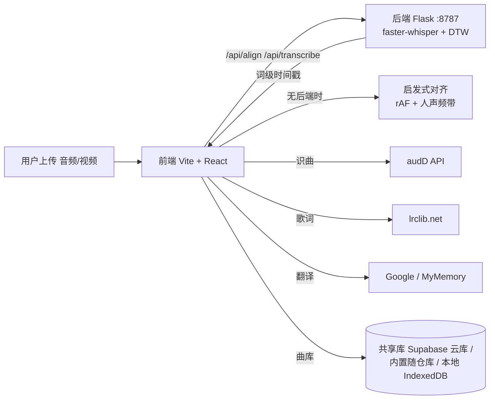

<p align="center">
  
</p>

<h1 align="center">🎤 SongLearn · 听歌学外语</h1>
<p align="center"><em>Learn any language by singing along to any song — with word-perfect lyric alignment.</em></p>

<p align="center">
  <b>中文</b>：上传一首歌 → 自动识曲 → 歌词逐句/逐词对齐 → 卡拉OK式跟唱 + 实时翻译 + 国际音标 + 中文音译。<br/>
  <b>English</b>: Upload a song → auto-recognize → line-by-line &amp; word-level lyric alignment → karaoke-style singing with real-time translation, IPA and pronunciation guides.
</p>

<p align="center">
  
  
  
  
  
  
</p>

---

## 📖 为什么做这个 / Why

现有「听歌学外语」工具都有一个顽疾：**歌词和歌声永远对不上**——前奏就蹦歌词、高潮对不上高亮、一拖进度条全乱。

Most "learn-a-language-with-music" tools share one fatal flaw: **the lyrics never actually match the singing** — lyrics pop up during the intro, highlights drift from the chorus, and dragging the progress bar breaks everything.

SongLearn 把同步引擎、歌词获取、语音对齐全部重写：

- **词级精确对齐**（whisper ASR + DTW）——歌词跟唱到哪一个字，屏幕上就亮到哪一个字
- **曲库是项目资产**——上传即入库，一条链接共享给所有人，越攒越值钱

## ✨ 核心特性 / Features

| 中文 | English | 实现 / How |
|---|---|---|
| 🎯 **歌词逐句+逐词对齐** | Line & word-level alignment | rAF 同步引擎零漂移 + whisper 词级时间戳 DTW 对齐 |
| 🧠 **AI 语音对齐（可选后端）** | Whisper word-align backend | Python + faster-whisper（base/small/tiny），词级精确对齐；未启动时自动降级启发式 |
| 🎧 **听声识曲** | Audio fingerprinting (audD) | 与"听歌识曲"同原理，不读文件名，免费 token 即用 |
| 📝 **自动找歌词** | Auto lyric lookup | lrclib.net 多通道取词 + 重音不敏感严格匹配，防串歌；可粘贴歌词辅助验证 |
| 🌍 **语言自动识别** | Auto language detection | 以西语歌为例：自动识别为 Español，发音标注/发音练习自动切换语种 |
| 🗣️ **实时翻译** | Real-time translation | 唱到哪句译到哪句，译成你选的母语（内置歌预置离线中文翻译，上传歌走在线接口兜底） |
| 🔤 **三层发音标注** | 3-layer pronunciation | 歌词原文 + 中文音译（teal）+ 国际音标 IPA（sky），唱之前就显示，留足准备时间 |
| 🔁 **单句精学** | Line-by-line practice | 唱完一句自动暂停，按播放=重唱这一句；循环只圈原唱人声，句尾伴奏不入循环 |
| 🎚️ **5 档语速** | 5 playback speeds | 0.5× / 0.75× / 1× / 1.25× / 1.5× 变速不跑调 |
| 🎤 **卡拉OK进度** | Karaoke progress | 逐词高亮跟随原唱，进度条可视化 |
| 📚 **三层曲库** | 3-tier song library | 共享库（人人可见）· 内置库（随仓库发布）· 本地缓存（秒开） |

## 🏗️ 架构 / Architecture



## 🚀 快速开始 / Quick Start

### 前端 / Frontend

```bash
npm install
npm run dev      # 本地开发 http://localhost:3000（/api 自动代理到后端 8787）
npm run build    # 构建，产物在 dist/
```

### 后端（词级对齐，可选）/ Backend (word-level alignment, optional)

```bash
cd backend
py -3.11 -m venv .venv        # 首次
.venv\Scripts\pip install -r requirements.txt
.venv\Scripts\python -m app --port 8787   # 启动对齐服务
# Windows 一键：双击 backend\start.cmd
```

后端未启动时，前端自动降级为启发式对齐——所有页面功能（歌词、音标、翻译、曲库）依然可用。

> The backend is optional. Without it the app falls back to heuristic alignment; with it you get whisper-precise word-level timestamps.

## ⚙️ 配置 / Configuration

| 功能 / Feature | 需要什么 / Requirement |
|---|---|
| 听声识曲 / Song recognition | 免费 audD token（[audd.io](https://audd.io) 注册即送，上传页粘贴保存） |
| 词级对齐 / Word alignment | Python 3.11 + 启动后端（自动探测 8787） |
| 找歌词 / 发音标注 | 零配置，开箱即用 |
| 共享曲库 / Shared library | 默认开箱即用（内置 Supabase 云库）；`?lib=<库ID>` 一条链接分享曲库，别人上传的歌自动进同一个库 |

## 🌐 部署 / Deploy

静态站点 + 可选后端，任选：

| 平台 / Platform | 方式 / How |
|---|---|
| **Netlify** | 拖 `dist/` 到 [Netlify Drop](https://app.netlify.com/drop) 或导入仓库（`netlify.toml` 已配好） |
| **Vercel** | 导入仓库即部署（`vercel.json` 已配好） |
| **GitHub Pages** | 推 `main` 分支自动部署（`.github/workflows/gh-pages.yml` 已配好） |

> 注意：静态托管（Netlify/Vercel/Pages）无法运行 Python 后端，词级对齐会降级为启发式；**完整精度需本地/自有服务器运行 backend**。
>
> Note: static hosts can't run the Python backend — word-level alignment falls back to heuristic. For full precision, run `backend` on your own machine/server.

## 📁 目录结构 / Project Structure

```
songlearn/
├── src/                        # React + TypeScript 前端
│   ├── App.tsx                 # 总编排：上传→识别→对齐→学唱 + 三层曲库
│   ├── components/
│   │   ├── KaraokeStage.tsx    # 卡拉OK逐词高亮 + 三层发音标注
│   │   ├── LearnStep.tsx       # 单句精学（暂停/重播/变速）
│   │   ├── PronunciationGuide.tsx # 歌曲语言发音学习面板
│   │   ├── AutoProcess.tsx     # 全自动流水线（识曲/找词/对齐）
│   │   ├── PipelineSteps.tsx   # 步骤指示
│   │   └── SongLibrary.tsx     # 三层曲库
│   ├── lib/
│   │   ├── align.ts            # 启发式对齐（FFT 乐句 + 人声频带 + 吸附）
│   │   ├── backend.ts          # 后端 8787 探测与调用（词级对齐）
│   │   ├── phonetics.ts        # 6 语言发音规则：IPA + 中文音译
│   │   ├── lrc.ts / lyrics.ts  # LRC 解析 + 自动找词 + 语言检测
│   │   ├── recognize.ts        # audD 听声识曲
│   │   ├── translate.ts        # 逐句翻译
│   │   ├── library.ts / globalLib.ts / songdb.ts  # 三层曲库
│   │   └── clock.ts            # 统一时间源（rAF 零漂移）
│   └── data/library.json       # 内置曲库种子
├── backend/                    # Python 对齐后端（可选）
│   ├── app.py                  # Flask 服务（/api/align /api/transcribe /api/health）
│   ├── aligner.py              # whisper ASR + DTW 词级对齐
│   ├── requirements.txt
│   └── start.cmd               # Windows 一键启动
├── .github/workflows/gh-pages.yml  # Pages 自动部署
├── netlify.toml / vercel.json      # 平台部署配置
└── vite.config.js
```

## 🗺️ 路线图 / Roadmap

- [ ] 跟唱打分（音高比对） / Singing score
- [ ] 生词本导出 Anki / Export vocab to Anki
- [ ] 共享曲库点赞 / 歌单分组 / Like & playlist
- [ ] PWA 离线缓存 / Offline PWA

## 📄 License

[MIT](LICENSE) — 欢迎 Star、Fork、提 PR（附产品截图的 PR 尤其欢迎）。
[MIT](LICENSE) — Star / Fork / PRs welcome (screenshots in PRs are especially appreciated).
