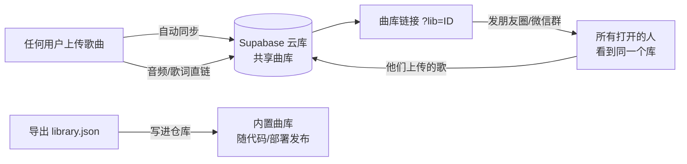

<p align="center">
  
</p>

<h1 align="center">SongLearn · 听歌学外语</h1>

<p align="center">
  上传一首歌（音频/视频都行）→ 自动识曲 → 歌词逐句对齐 → <strong>原声逐句跟唱</strong>。<br/>
  逐词 IPA 音标、对应语言的发音学习、5 档语速、卡拉OK 高亮、实时翻译，一应俱全。<br/>
  <strong>曲库是项目资产</strong>：上传即入库，一条链接共享给所有人，越攒越值钱。
</p>

<p align="center">
  
  
  
  
  
  
</p>

---

## 为什么做这个

现有「听歌学外语」工具都有顽疾：

- **歌词和歌声永远对不上**——前奏就蹦歌词、高潮对不上高亮、一拖进度条全乱；
- **发音没法跟**——要么没有音标，要么是机器音合成的"假唱"，根本没法跟读；
- **曲库是一次性的**——上传的歌锁死在某个浏览器里，换个设备就没了。

SongLearn 全部重写：同步引擎、歌词获取、发音教学、共享曲库，**专治这三个顽疾**。

## 核心特性

| 能力 | 实现方式 |
|---|---|
| 🎯 **歌词逐句对齐** | rAF 同步引擎只读媒体时钟（零漂移）+ 人声频带检测 + 乐句点吸附 |
| 🎤 **原声逐句跟唱** | 直接用你上传的原曲切句跟读（不是机器合成音），单句循环、唱完即停 |
| 🎵 **卡拉OK 高亮** | 逐字滚动高亮当前句 + 进度条，唱到哪亮到哪 |
| 🔤 **逐词 IPA 音标** | 音标像拼音一样**注在歌词正上方**，点词即读；英文走内置词表+在线兜底，西语本地规则转写 |
| 📖 **发音学习** | 按歌曲语言内置 9 种语言发音表（英/西/法/德/日/韩/葡/意/中）：音标+示例词+中文要领，点词听读 |
| ⏱️ **5 档语速** | 0.5× 极慢拆音 / 0.75× 慢速细听 / 1× / 1.25× / 1.5× 加速回听 |
| 🗣️ **实时翻译** | 唱到哪句译到哪句，译成你选的母语（Google/MyMemory 免费接口） |
| 🎧 **听声识曲** | audD 音频指纹（与"听歌识曲"同原理，不读文件名），免费 token 即用 |
| 📝 **自动找歌词** | lrclib.net 多通道取词 + AI 识别校对 + 重音不敏感严格匹配，防串歌 |
| 🎬 **视频也能学** | 直接上传 MV/翻唱视频，自动提取音轨；视频画面可选显示或隐藏 |
| 📚 **三层曲库** | 共享库（人人可见，越攒越值钱）· 内置库（随仓库发布）· 本地缓存（秒开） |

## 曲库：项目资产，越攒越值钱

这是 SongLearn 与普通工具最大的区别——**曲库不属于某个浏览器，属于整个项目**：



- **共享曲库（Supabase 云库，零配置）**：歌曲索引（歌名/歌手/时长/热度/上传者）+ 歌词 + 音频全部进云端共享表。在歌曲库里点「创建共享曲库」，把**曲库链接**发出去，任何人点开都进入同一个库；**他们上传的歌自动进这个库**，带上传者署名和学唱热度。本地缓存里的旧歌也能一键「☁ 上云」补录。
- **内置曲库（随项目走）**：歌曲库 → 「导出曲库」下载 `library.json`，覆盖进 `src/data/library.json` 重新部署——曲库就"长"进项目里，下载项目、重新发布都带着全部歌曲。
- **本地缓存（体验层）**：每首歌连同音频存进浏览器 IndexedDB，下次点开秒进学唱页；云端歌曲打开过一次也会自动落一份本地缓存。

三层自动合并去重（本地 > 云端 > 内置），同名歌只留一条。

## 快速开始

```bash
npm install
npm run dev      # 本地开发 → http://localhost:5173
npm run build    # 构建，产物在 dist/
```

### 配置（只有一项，可选）

| 功能 | 需要什么 |
|---|---|
| 听声识曲 | 免费 audD token：[audd.io](https://audd.io) 注册即送，上传页粘贴保存 |
| 共享曲库 | **什么都不需要**，内置 Supabase 云库，歌曲库一键创建 |
| 找歌词 / 音标 / 翻译 / 发音 | 无需配置，直连免费接口 |

## 部署

静态站点，四个平台任选（曲库跟着走，部署后把 `你的域名/?lib=库ID` 发出去即可）：

- **GitHub Pages**：推 `main` 分支自动部署（`.github/workflows/gh-pages.yml` 已配好）
- **Vercel**：导入仓库即部署（`vercel.json` 已配好）
- **Netlify**：拖 `dist/` 到 [Netlify Drop](https://app.netlify.com/drop) 或导入仓库（`netlify.toml` 已配好）
- **Cloudflare Pages**：直连仓库，构建命令 `npm run build`，输出目录 `dist/`

## 技术栈与目录

```
src/
├── App.tsx                          # 总编排：四步流水线 + 三层曲库 + 云同步
├── components/
│   ├── KaraokeStage.tsx             # 卡拉OK：逐句高亮 + 逐词音标注音 + 点击朗读
│   ├── LearnStep.tsx                # 学唱页：播放控制 + 5 档语速 + 单词本
│   ├── PronunciationLab.tsx         # 对应语言的发音学习区
│   ├── SongLibrary.tsx              # 曲库抽屉：云端/内置/本地 + 上云 + 导出导入
│   ├── AutoProcess.tsx              # 自动处理流水线
│   └── PipelineSteps.tsx            # 步骤指示
├── hooks/useSyncEngine.ts           # rAF 同步引擎（零漂移的心脏）
├── lib/
│   ├── phonetics.ts                 # 逐词 IPA（英文三级兜底 + 西语规则转写）+ 朗读语音
│   ├── align.ts                     # FFT 乐句检测 + 人声频带 + 锚点吸附
│   ├── lrc.ts                       # LRC 解析 + 纯文本切句
│   ├── lyrics.ts                    # 多通道取词 + AI 校对 + 语言检测
│   ├── recognize.ts                 # audD 听声识曲
│   ├── globalLib.ts                 # Supabase 共享曲库读写
│   ├── library.ts                   # 三层合并 / 导出导入 / 内置库
│   ├── songdb.ts                    # 本地 IndexedDB 存档
│   ├── translate.ts                 # 逐句翻译（Google gtx + MyMemory 备源）
│   └── clock.ts                     # 统一时间源抽象（audio/video 通用）
└── data/
    ├── pronunciation.ts             # 9 种语言发音学习数据
    ├── en-ipa.json                  # 英文高频词内置音标表
    └── library.json                 # 内置曲库种子（导出后覆盖这里）
```

## 路线图

- [ ] 跟唱打分（音高比对）
- [ ] 生词本导出 Anki
- [ ] 共享曲库点赞 / 歌单分组
- [ ] PWA 离线缓存

## License

[MIT](LICENSE) — 欢迎 Star、Fork、提 PR（附产品截图的 PR 尤其欢迎）。
